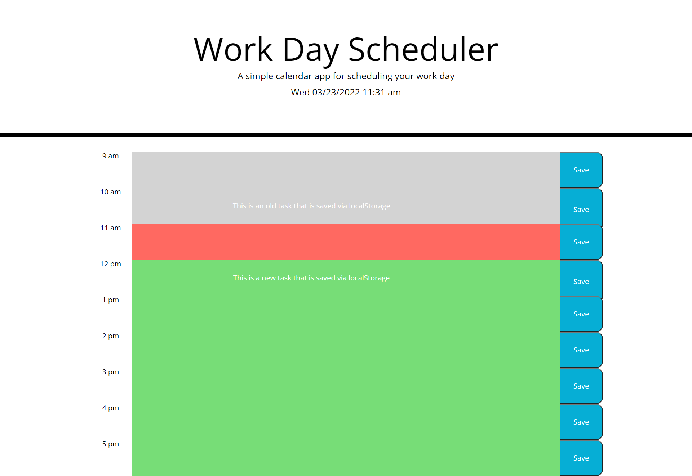

# Make It Work

## Goal for this project
The web app allows users to provide themselves with tasks to do throughout regular working hours or 9am-5pm.
Every new day, tasks will reset to represent a new working schedule, deleting previous tasks and allowing for new
ones to be added.

Each row is color-graded as follows:
* **Gray** - Past Time
* **Red** - Present Time
* **Green** - Future Time

 

[Click on this sentence to access the web app!](https://malikspruill.github.io/make-it-work/)

## Technologies Used
JavaScript/Jquery  
CSS/Bootstrap  
date-fns (for dates/time)

## Contributions
Malik Spruill